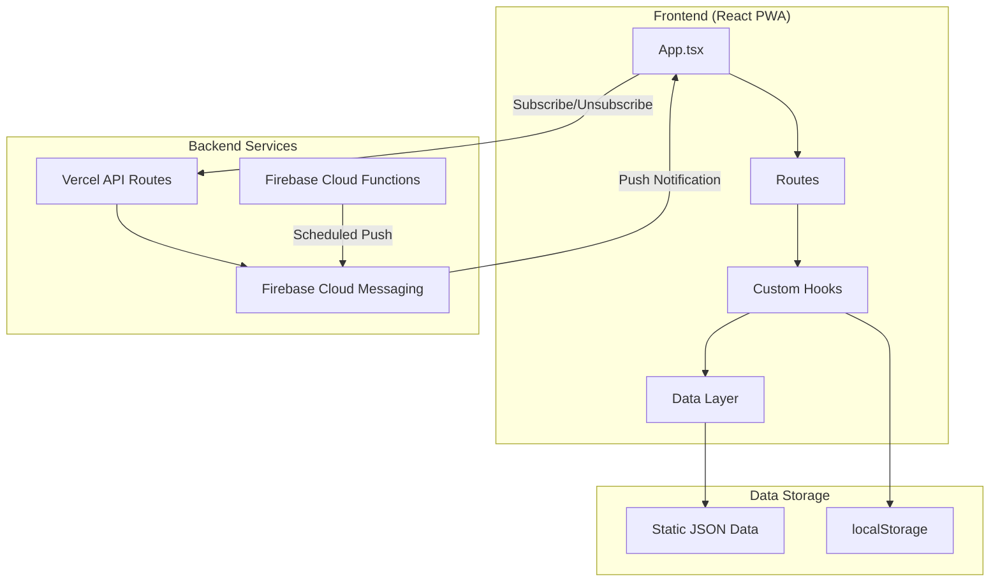
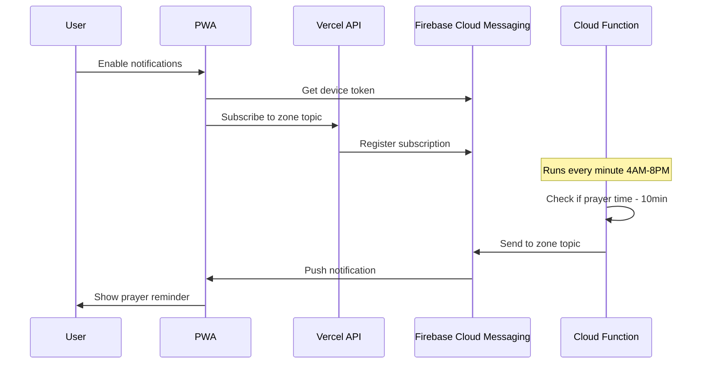

# Prayer Times Sri Lanka

A modern, mobile-first Progressive Web App (PWA) for Islamic prayer times and Hijri calendar across all districts in Sri Lanka.

## Features

### Prayer Times
- **All 26 Districts**: Complete coverage of Sri Lanka across 13 prayer time zones
- **Daily, Weekly & Monthly Views**: Multiple ways to view prayer schedules
- **Auto Location Detection**: Automatically detects your nearest district using GPS
- **Prayer Alarms**: Set notifications for any prayer time (with 10-minute reminders)
- **Next Prayer Countdown**: Visual countdown timer with progress indicator

### Hijri Calendar
- **Full Hijri Calendar**: Monthly calendar view with Hijri and Gregorian dates
- **Moon Phases**: Visual moon phase indicators for each day
- **Islamic Events**: Highlighted important dates (Ramadan, Eid, etc.)
- **Special Day Indicators**: Fasting days, holy nights, and recommended practices
- **Event Details**: Tap any event for detailed information and virtues

### Push Notifications
- **Background Notifications**: Receive prayer reminders even when the app is closed
- **Zone-Based**: Notifications are sent based on your district's prayer times
- **No Login Required**: Just enable notifications and select your district
- **iOS & Android Support**: Works on both platforms (iOS requires PWA installation)

### App Features
- **Dark/Light Mode**: Theme toggle for comfortable viewing
- **Offline Support**: Works without internet after first load (PWA)
- **Installable**: Add to home screen for native app experience
- **URL Routing**: Deep links to specific sections (`/prayer`, `/prayer/week`, `/hijri`)
- **Mobile-First Design**: Optimized for mobile with bottom navigation
- **Code Splitting**: Fast initial load with route-based lazy loading

## Architecture



## Routes

| Route | Description |
|-------|-------------|
| `/` | Landing page with next prayer countdown |
| `/prayer` | Today's prayer times |
| `/prayer/week` | Weekly prayer schedule |
| `/prayer/month` | Monthly prayer schedule |
| `/hijri` | Hijri calendar view |

## Districts Covered

| Zone | Districts |
|------|-----------|
| 01 | Colombo, Gampaha, Kalutara |
| 02 | Jaffna, Nallur |
| 03 | Mullaitivu, Kilinochchi, Vavuniya |
| 04 | Mannar, Puttalam |
| 05 | Anuradhapura, Polonnaruwa |
| 06 | Kurunegala |
| 07 | Kandy, Matale, Nuwara Eliya |
| 08 | Batticaloa, Ampara |
| 09 | Trincomalee |
| 10 | Badulla, Monaragala |
| 11 | Ratnapura, Kegalle |
| 12 | Galle, Matara |
| 13 | Hambantota |

## Tech Stack

- **React 19** with TypeScript
- **React Router 7** for client-side routing
- **Vite 7** for fast development and builds
- **Tailwind CSS v4** with shadcn/ui components
- **PWA** with Workbox service worker for offline support
- **Firebase Cloud Messaging** for push notifications
- **Vercel** for hosting and serverless API routes

## Getting Started

```bash
# Install dependencies
npm install

# Run development server
npm run dev

# Build for production
npm run build

# Run tests
npm run test

# Preview production build
npm run preview
```

## Push Notifications

### How It Works



### Enabling Notifications

1. Open the app and tap the notification bell icon
2. Select your district from the dropdown
3. Grant notification permission when prompted
4. You'll receive notifications 10 minutes before each prayer

### iOS Requirements

Push notifications on iOS require:
- iOS 16.4 or later
- The app must be installed to your home screen (not just opened in Safari)

To install on iOS:
1. Open the app in Safari
2. Tap the Share button
3. Tap "Add to Home Screen"
4. Open the app from your home screen

## Project Structure

```
src/
├── components/          # React components
│   ├── ui/             # shadcn/ui components
│   ├── common/         # Shared components (LoadingSpinner, etc.)
│   ├── layouts/        # Layout components (PrayerLayout)
│   ├── landing/        # Landing page components
│   ├── calendar/       # Hijri calendar components
│   └── notifications/  # Push notification UI
├── hooks/              # Custom React hooks
│   ├── useAlarms.ts    # Local notification scheduling
│   ├── usePrayerTimes.ts
│   ├── useHijriCalendar.ts
│   ├── useIslamicEvents.ts
│   └── usePushNotifications.ts
├── contexts/           # React Context providers
│   ├── LocationContext.tsx
│   ├── ThemeContext.tsx
│   └── PushNotificationContext.tsx
├── data/               # Static JSON data
│   ├── prayerTimes.json
│   ├── hijriCalendar.json
│   └── islamicEvents.json
├── lib/                # Utilities and data access
│   ├── data/          # Data access layer
│   ├── firebase/      # Firebase SDK setup
│   ├── utils/         # Utility functions
│   └── constants/     # App constants
└── App.tsx            # Main app with routing
```

## Islamic Months

| # | Arabic Name | Transliteration |
|---|-------------|-----------------|
| 1 | محرم | Muharram |
| 2 | صفر | Safar |
| 3 | ربيع الأول | Rabi al-Awwal |
| 4 | ربيع الثاني | Rabi al-Thani |
| 5 | جمادى الأولى | Jumada al-Awwal |
| 6 | جمادى الآخرة | Jumada al-Akhirah |
| 7 | رجب | Rajab |
| 8 | شعبان | Shaban |
| 9 | رمضان | Ramadan |
| 10 | شوال | Shawwal |
| 11 | ذو القعدة | Dhul Qadah |
| 12 | ذو الحجة | Dhul Hijjah |

## Important Islamic Events

| Event | Date (Hijri) | Significance |
|-------|--------------|--------------|
| Islamic New Year | 1 Muharram | Beginning of new Hijri year |
| Ashura | 10 Muharram | Day of fasting |
| Mawlid al-Nabi | 12 Rabi al-Awwal | Prophet Muhammad's (PBUH) birthday |
| Isra and Mi'raj | 27 Rajab | Night journey of Prophet Muhammad (PBUH) |
| Shab e Barat | 15 Shaban | Night of forgiveness |
| Ramadan Begins | 1 Ramadan | Start of fasting month |
| Laylat al-Qadr | 27 Ramadan | Night of Power |
| Eid al-Fitr | 1 Shawwal | Festival marking end of Ramadan |
| Day of Arafah | 9 Dhul Hijjah | Day before Eid al-Adha |
| Eid al-Adha | 10 Dhul Hijjah | Festival of Sacrifice |

## Data Sources

- [ACJU (All Ceylon Jamiyyathul Ulama)](https://www.acju.lk/prayer-times/) - Prayer times data
- [ACJU Calendars](https://www.acju.lk/calenders-en/) - Official moon sighting announcements
- [SLHub Hilaal Calendar](https://www.slhub.com/downloads/hilaal-calendar) - Monthly Hijri calendars

## Documentation

- [Architecture Documentation](./plan-docs/ARCHITECTURE.md) - Detailed system architecture
- [Push Notifications Plan](./plan-docs/PUSH_NOTIFICATIONS_PLAN.md) - Push notification implementation details

## License

MIT

## Acknowledgments

- [ACJU](https://www.acju.lk/) for prayer times and Islamic calendar data
- [shadcn/ui](https://ui.shadcn.com/) for UI components
- [Lucide](https://lucide.dev/) for icons
- [Firebase](https://firebase.google.com/) for push notifications
