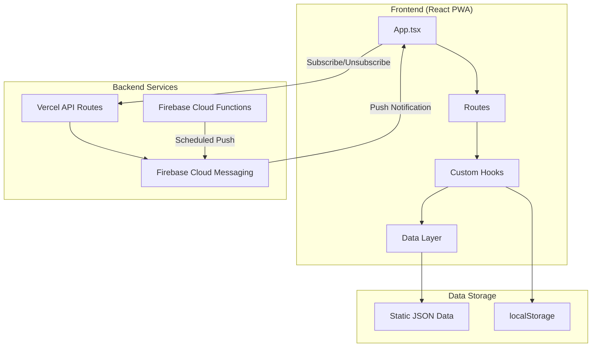
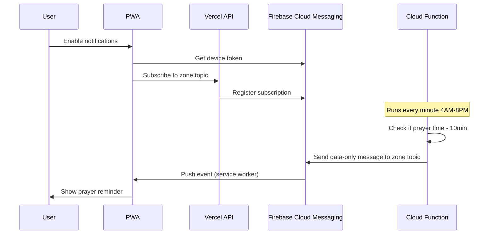

# Prayer Times Sri Lanka

A modern, mobile-first Progressive Web App (PWA) for Islamic prayer times and Hijri calendar across all districts in Sri Lanka.

## Features

### Prayer Times
- **All 26 Districts**: Complete coverage of Sri Lanka across 13 prayer time zones
- **Daily, Weekly & Monthly Views**: Multiple ways to view prayer schedules
- **Auto Location Detection**: Automatically detects your nearest district using GPS
- **Prayer Alarms**: Set notifications for any prayer time (with 10-minute reminders)
- **Next Prayer Countdown**: Visual countdown timer with progress indicator

### Hijri Calendar
- **Full Hijri Calendar**: Monthly calendar view with Hijri and Gregorian dates
- **Moon Phases**: Visual moon phase indicators for each day
- **Islamic Events**: Highlighted important dates (Ramadan, Eid, etc.)
- **Special Day Indicators**: Fasting days, holy nights, and recommended practices
- **Event Details**: Tap any event for detailed information and virtues

### Push Notifications
- **Background Notifications**: Receive prayer reminders even when the app is closed
- **Zone-Based**: Notifications are sent based on your district's prayer times
- **No Login Required**: Just enable notifications and select your district
- **iOS & Android Support**: Works on both platforms (iOS requires PWA installation)

### App Features
- **Dark/Light Mode**: Theme toggle for comfortable viewing
- **Offline Support**: Works without internet after first load (PWA)
- **Installable**: Add to home screen for native app experience
- **URL Routing**: Deep links to specific sections (`/prayer`, `/prayer/week`, `/hijri`)
- **Mobile-First Design**: Optimized for mobile with bottom navigation
- **Code Splitting**: Fast initial load with route-based lazy loading

## Architecture



## Routes

| Route | Description |
|-------|-------------|
| `/` | Landing page with next prayer countdown |
| `/prayer` | Today's prayer times |
| `/prayer/week` | Weekly prayer schedule |
| `/prayer/month` | Monthly prayer schedule |
| `/hijri` | Hijri calendar view |

## Districts Covered

| Zone | Districts |
|------|-----------|
| 01 | Colombo, Gampaha, Kalutara |
| 02 | Jaffna, Nallur |
| 03 | Mullaitivu, Kilinochchi, Vavuniya |
| 04 | Mannar, Puttalam |
| 05 | Anuradhapura, Polonnaruwa |
| 06 | Kurunegala |
| 07 | Kandy, Matale, Nuwara Eliya |
| 08 | Batticaloa, Ampara |
| 09 | Trincomalee |
| 10 | Badulla, Monaragala |
| 11 | Ratnapura, Kegalle |
| 12 | Galle, Matara |
| 13 | Hambantota |

## Tech Stack

- **React 19** with TypeScript
- **React Router 7** for client-side routing
- **Vite 7** for fast development and builds
- **Tailwind CSS v4** with shadcn/ui components
- **PWA** with Workbox service worker for offline support
- **Firebase Cloud Messaging** for push notifications
- **Vercel** for hosting and serverless API routes

## Getting Started

```bash
# Install dependencies
npm install

# Run development server
npm run dev

# Build for production
npm run build

# Run unit tests
npm run test

# Run end-to-end tests (service worker, push notifications, icons)
npm run test:e2e

# Preview production build
npm run preview
```

## Push Notifications

### How It Works



### Service Worker

One service worker, built from `src/sw.ts` with the `injectManifest` strategy of
`vite-plugin-pwa`, handles both offline precaching (Workbox) and Firebase Cloud
Messaging. It is registered at scope `/`.

Design rules that keep notifications from duplicating or piling up:

- The Cloud Function sends **data-only** messages. A `notification` block would
  make the Firebase SDK display the message itself in addition to the service
  worker handler.
- Every prayer reminder uses the same notification `tag`, so the next reminder
  replaces the previous one. The message `TTL` matches the 10-minute reminder
  window so stale reminders expire instead of arriving late.
- Local alarms (`useAlarms`) skip the 10-minute reminder when push is enabled and
  only fire the at-prayer-time notification.
- The notification text and options come from one builder,
  `src/lib/notifications/prayerNotification.ts`, shared by the service worker,
  the foreground handler and local alarms.

Icons live in `public/`: `icon-192x192.png` and `icon-512x512.png` (purpose
`any`), `icon-maskable-512x512.png` (full bleed, purpose `maskable`),
`apple-touch-icon.png`, and `badge-96x96.png`, a white-on-transparent silhouette
that Android uses as the status-bar icon.

### Enabling Notifications

1. Open the app and tap the notification bell icon
2. Select your district from the dropdown
3. Grant notification permission when prompted
4. You'll receive notifications 10 minutes before each prayer

### iOS Requirements

Push notifications on iOS require:
- iOS 16.4 or later
- The app must be installed to your home screen (not just opened in Safari)

To install on iOS:
1. Open the app in Safari
2. Tap the Share button
3. Tap "Add to Home Screen"
4. Open the app from your home screen

## Hijri Calendar Sync

`src/data/hijriCalendar.json` always ends with three entries: the last
**completed** month, the **ongoing** month (assumed 30 days) and the
**upcoming** month (assumed 30 days). When ACJU announces a moon sighting the
`sync-hijri-acju` workflow closes the ongoing month with its real length,
promotes the upcoming month and appends a new upcoming month.

The workflow runs on a schedule at 21:00 and 06:00 Sri Lanka time. Scheduled
runs set `WHEN_DUE=true`, so the script only contacts ACJU from day 29 of the
ongoing month onwards; the first check is the evening of the 29th, the next the
30th. Runs that find nothing new make no commit. The workflow can also be
dispatched manually (or from the admin page) with an optional `count` cap.

```bash
# Preview what a sync would change without writing
DRY_RUN=true node scripts/sync-hijri-acju.js

# Apply, but only if the ongoing month is on day 29 or later
WHEN_DUE=true node scripts/sync-hijri-acju.js
```

## Project Structure

```
e2e/                     # Playwright end-to-end tests
src/
├── sw.ts                # Service worker (Workbox precache + FCM push)
├── components/          # React components
│   ├── ui/             # shadcn/ui components
│   ├── common/         # Shared components (LoadingSpinner, etc.)
│   ├── layouts/        # Layout components (PrayerLayout)
│   ├── landing/        # Landing page components
│   ├── calendar/       # Hijri calendar components
│   └── notifications/  # Push notification UI
├── hooks/              # Custom React hooks
│   ├── useAlarms.ts    # Local notification scheduling
│   ├── usePrayerTimes.ts
│   ├── useHijriCalendar.ts
│   ├── useIslamicEvents.ts
│   └── usePushNotifications.ts
├── contexts/           # React Context providers
│   ├── LocationContext.tsx
│   ├── ThemeContext.tsx
│   └── PushNotificationContext.tsx
├── data/               # Static JSON data
│   ├── prayerTimes.json
│   ├── hijriCalendar.json
│   └── islamicEvents.json
├── lib/                # Utilities and data access
│   ├── data/          # Data access layer
│   ├── firebase/      # Firebase SDK setup
│   ├── notifications/ # Notification builder, push settings, display helpers
│   ├── utils/         # Utility functions
│   └── constants/     # App constants
└── App.tsx            # Main app with routing
```

## Islamic Months

| # | Arabic Name | Transliteration |
|---|-------------|-----------------|
| 1 | محرم | Muharram |
| 2 | صفر | Safar |
| 3 | ربيع الأول | Rabi al-Awwal |
| 4 | ربيع الثاني | Rabi al-Thani |
| 5 | جمادى الأولى | Jumada al-Awwal |
| 6 | جمادى الآخرة | Jumada al-Akhirah |
| 7 | رجب | Rajab |
| 8 | شعبان | Shaban |
| 9 | رمضان | Ramadan |
| 10 | شوال | Shawwal |
| 11 | ذو القعدة | Dhul Qadah |
| 12 | ذو الحجة | Dhul Hijjah |

## Important Islamic Events

| Event | Date (Hijri) | Significance |
|-------|--------------|--------------|
| Islamic New Year | 1 Muharram | Beginning of new Hijri year |
| Ashura | 10 Muharram | Day of fasting |
| Mawlid al-Nabi | 12 Rabi al-Awwal | Prophet Muhammad's (PBUH) birthday |
| Isra and Mi'raj | 27 Rajab | Night journey of Prophet Muhammad (PBUH) |
| Shab e Barat | 15 Shaban | Night of forgiveness |
| Ramadan Begins | 1 Ramadan | Start of fasting month |
| Laylat al-Qadr | 27 Ramadan | Night of Power |
| Eid al-Fitr | 1 Shawwal | Festival marking end of Ramadan |
| Day of Arafah | 9 Dhul Hijjah | Day before Eid al-Adha |
| Eid al-Adha | 10 Dhul Hijjah | Festival of Sacrifice |

## Data Sources

- [ACJU (All Ceylon Jamiyyathul Ulama)](https://www.acju.lk/prayer-times/) - Prayer times data
- [ACJU Calendars](https://www.acju.lk/calenders-en/) - Official moon sighting announcements
- [SLHub Hilaal Calendar](https://www.slhub.com/downloads/hilaal-calendar) - Monthly Hijri calendars

## Documentation

- [Architecture Documentation](./plan-docs/ARCHITECTURE.md) - Detailed system architecture
- [Push Notifications Plan](./plan-docs/PUSH_NOTIFICATIONS_PLAN.md) - Push notification implementation details

## License

MIT

## Acknowledgments

- [ACJU](https://www.acju.lk/) for prayer times and Islamic calendar data
- [shadcn/ui](https://ui.shadcn.com/) for UI components
- [Lucide](https://lucide.dev/) for icons
- [Firebase](https://firebase.google.com/) for push notifications
