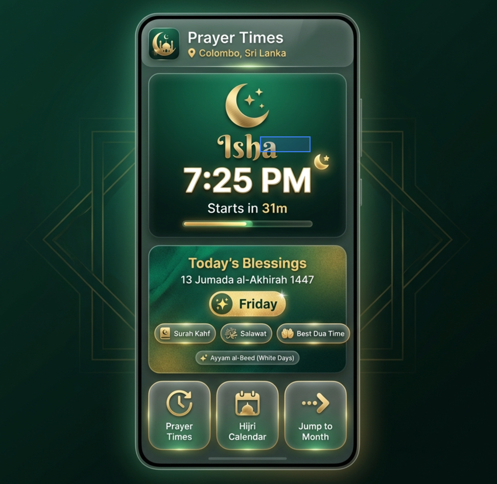

Landing Page Implementation Plan
A new mobile-first landing page showing next prayer, today's blessings, and quick navigation.

Design Reference
Landing Page Mockup
Review
Landing Page Mockup

Key Features
Section	Content
Header	App branding, location selector, theme toggle
Hero	Next prayer name, time, countdown, progress bar
Today's Blessings	Hijri date, day badges (Friday, fasting), recommended Ibadah pills
Quick Nav	Prayer Times, Hijri Calendar, Jump to Month
Navigation Flow
Landing Page
Prayer Times
Hijri Calendar
Jump to Month Dialog
Today/Week/Month Views
Full Calendar with Events
Proposed Changes
1. New Component
   [NEW]
   LandingPage.tsx
   Structure:

<LandingPage>
  ├── Hero Section (Next Prayer)
  │   ├── Prayer name + Arabic
  │   ├── Time display
  │   ├── Countdown + Progress bar
  │   └── Moon phase indicator
  │
  ├── Today's Blessings Card
  │   ├── Hijri date display
  │   ├── Day badges (Friday, Ayyam al-Beed, etc.)
  │   ├── Recommended Ibadah pills (clickable)
  │   └── Month virtue snippet
  │
  └── Navigation Cards
      ├── Prayer Times → mainSection='prayer'
      ├── Hijri Calendar → mainSection='hijri'
      └── Jump to Month → Dialog picker
2. App Structure Change
[MODIFY] 
App.tsx
Add new 
MainSection
 type: 'home' | 'prayer' | 'hijri'
Default to 'home' section
Render <LandingPage> when mainSection === 'home'
Pass navigation callbacks to LandingPage
3. Header Update
[MODIFY] 
Header.tsx
Add "Home" option to segmented control
Update styling for 3-way toggle
UI/UX Details
Hero Section
Background: Primary gradient (emerald) with subtle pattern
Prayer Name: Display font, very large (text-4xl)
Time: Monospace-ish, prominent
Countdown: Pill badge with "Starts in Xh Xm"
Progress: Thin bar showing time elapsed since last prayer
Today's Blessings
Card: Glassmorphism effect
Hijri Date: Prominent with month name
Badges: Color-coded pills for Friday, fasting days, etc.
Ibadah Pills: Tappable → opens VirtuesSheet with details
Month Virtue: One-liner teaser with "Read more" → full content
Navigation Cards
Layout: 3-column grid on mobile
Style: Glass cards with icons
Interaction: Tap → navigate to section
Data Requirements
Data	Source
Next prayer	usePrayerTimes hook
Hijri date	useHijriCalendar hook
Today's events	
useIslamicEvents
 hook
Fasting info	useIslamicEvents.isFastingDay
Month virtues	
virtues.json
 via hook
Verification
Build passes
Landing page renders correctly
Navigation works between all sections
Clickable Ibadah pills open VirtuesSheet
Responsive on mobile and desktop