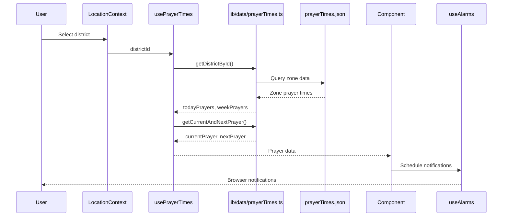
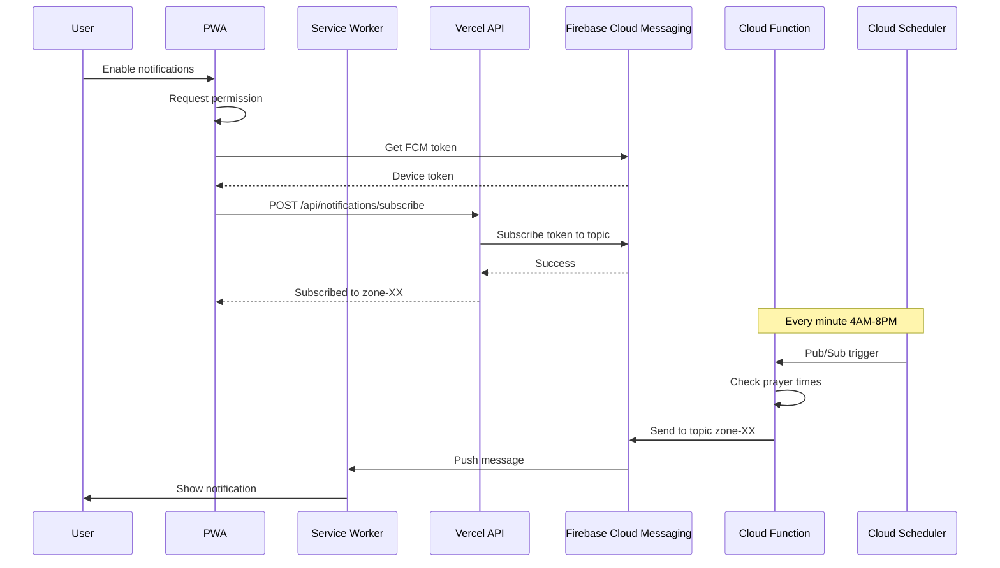
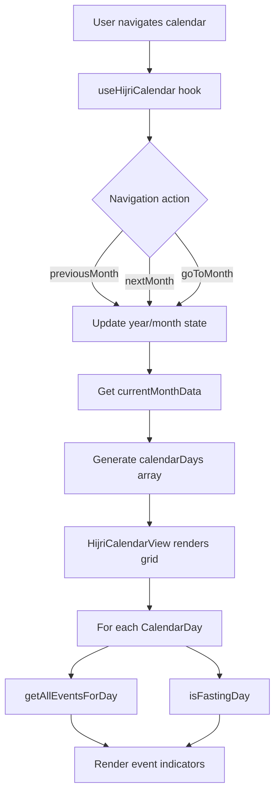
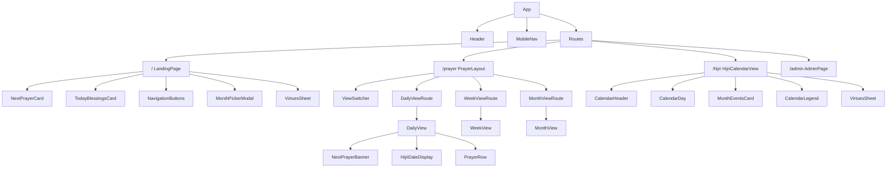
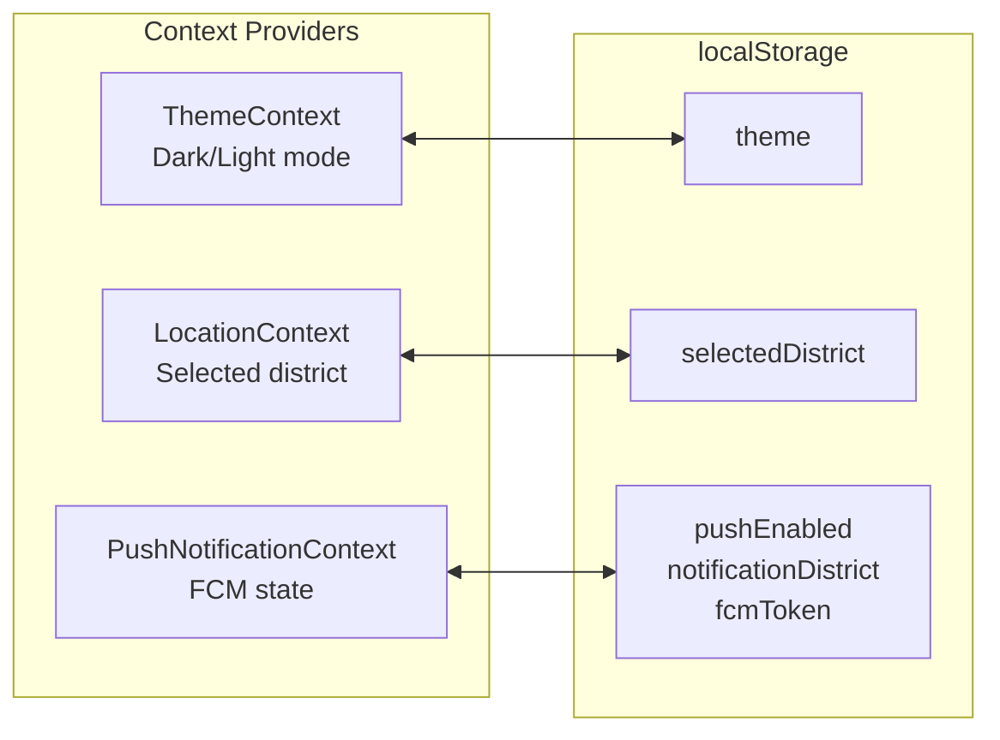
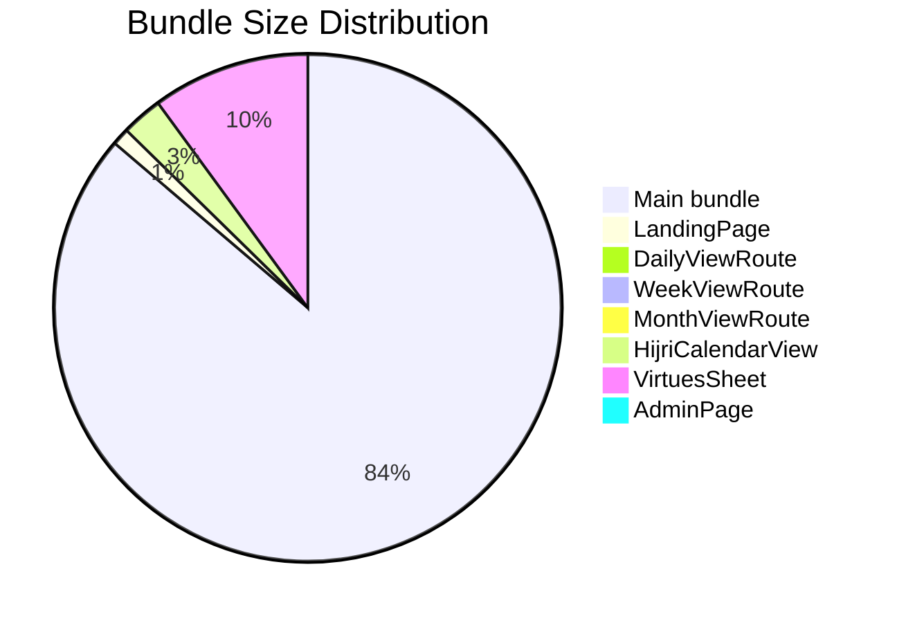
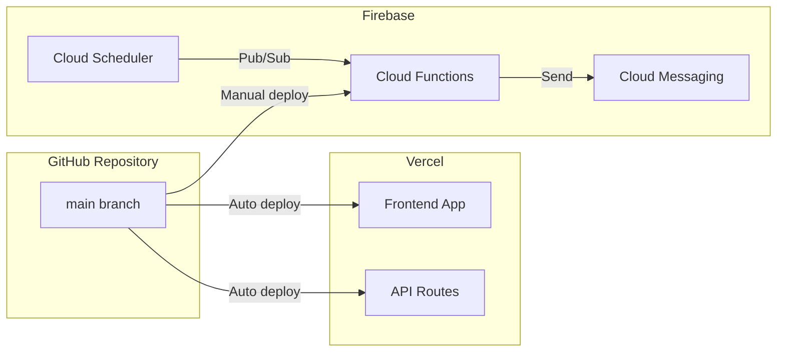

# Architecture Documentation

## Project Overview

**Prayer Times Sri Lanka** is a Progressive Web App (PWA) providing Islamic prayer times and Hijri calendar for all 26 districts across Sri Lanka's 13 prayer time zones.

### Tech Stack

| Layer | Technology |
|-------|------------|
| Frontend Framework | React 19 |
| Language | TypeScript 5.9 |
| Build Tool | Vite 7 |
| Styling | Tailwind CSS 4 + shadcn/ui |
| Routing | React Router 7 |
| PWA | vite-plugin-pwa + Workbox |
| Push Notifications | Firebase Cloud Messaging |
| API (Serverless) | Vercel Functions |
| Scheduled Jobs | Firebase Cloud Functions |

---

## Directory Structure

```
prayer-times-app/
├── src/                              # Frontend source code
│   ├── components/                   # React components
│   │   ├── ui/                       # shadcn/ui primitives (14 components)
│   │   ├── admin/                    # Admin panel components
│   │   ├── calendar/                 # Hijri calendar components
│   │   ├── common/                   # Shared components
│   │   ├── layouts/                  # Layout components (PrayerLayout)
│   │   ├── landing/                  # Landing page sub-components
│   │   └── notifications/            # Push notification UI
│   ├── contexts/                     # React Context providers
│   │   ├── LocationContext.tsx       # Selected district state
│   │   ├── ThemeContext.tsx          # Dark/light mode
│   │   └── PushNotificationContext.tsx
│   ├── hooks/                        # Custom React hooks
│   │   ├── useAlarms.ts              # Local notification scheduling
│   │   ├── useCountdown.ts           # Next prayer countdown
│   │   ├── useHijriCalendar.ts       # Calendar navigation
│   │   ├── useIslamicEvents.ts       # Events and fasting days
│   │   ├── useLocation.ts            # Geolocation
│   │   ├── usePrayerTimes.ts         # Prayer data access
│   │   ├── usePushNotifications.ts   # FCM integration
│   │   └── useTheme.ts               # Theme management
│   ├── lib/                          # Utilities and data layer
│   │   ├── constants/                # App constants (8 files)
│   │   ├── data/                     # Data access layer
│   │   ├── firebase/                 # Firebase SDK setup
│   │   └── utils/                    # Pure utility functions
│   ├── data/                         # Static JSON data
│   │   ├── prayerTimes.json          # Prayer times (13 zones x 12 months)
│   │   ├── hijriCalendar.json        # Hijri-Gregorian mapping
│   │   ├── islamicEvents.json        # Events and fasting rules
│   │   └── virtues.json              # Markdown content
│   ├── test/                         # Test setup
│   ├── App.tsx                       # Main app with routing
│   └── main.tsx                      # Entry point with providers
├── api/                              # Vercel Serverless Functions
│   ├── notifications/
│   │   ├── subscribe.js              # FCM topic subscription
│   │   └── unsubscribe.js            # FCM topic unsubscription
│   ├── templates/                    # Email/page templates
│   ├── request-update.js             # Admin: Hijri update request
│   ├── confirm-update.js             # Admin: Confirm update
│   ├── request-rollback.js           # Admin: Rollback request
│   └── confirm-rollback.js           # Admin: Confirm rollback
├── functions/                        # Firebase Cloud Functions
│   ├── index.js                      # Scheduled notification sender
│   ├── data/                         # Copied prayer times data
│   └── package.json                  # Node.js 20 runtime
├── public/                           # Static assets
│   ├── firebase-messaging-sw.js      # FCM service worker
│   └── icon-192x192.png              # PWA icon
├── scripts/                          # Automation scripts
│   ├── update-hijri.js               # GitHub Actions: Update calendar
│   └── rollback-hijri.js             # GitHub Actions: Rollback
└── .github/workflows/                # CI/CD pipelines
    ├── ci.yml                        # Test and lint
    ├── update-hijri.yml              # Hijri update workflow
    └── rollback-hijri.yml            # Hijri rollback workflow
```

---

## Application Architecture

```mermaid
flowchart TB
    subgraph React["React Application"]
        subgraph Providers["Provider Layer"]
            Theme["ThemeProvider"]
            Location["LocationProvider"]
            Push["PushNotificationProvider"]
        end
        
        subgraph Routes["Routing Layer"]
            Landing["/ - LandingPage"]
            Prayer["PrayerLayout"]
            Daily["/prayer - DailyView"]
            Week["/prayer/week - WeekView"]
            Month["/prayer/month - MonthView"]
            Hijri["/hijri - HijriCalendarView"]
            Admin["/admin - AdminPage"]
        end
        
        subgraph Hooks["Hooks Layer"]
            usePrayerTimes["usePrayerTimes"]
            useHijriCalendar["useHijriCalendar"]
            useIslamicEvents["useIslamicEvents"]
            useAlarms["useAlarms"]
            useCountdown["useCountdown"]
            usePushNotifications["usePushNotifications"]
        end
        
        subgraph Data["Data Access Layer"]
            prayerTimesLib["lib/data/prayerTimes.ts"]
            hijriLib["lib/data/hijriCalendar.ts"]
            eventsLib["lib/data/islamicEvents.ts"]
        end
        
        subgraph JSON["Static Data (JSON)"]
            prayerJSON["prayerTimes.json"]
            hijriJSON["hijriCalendar.json"]
            eventsJSON["islamicEvents.json"]
            virtuesJSON["virtues.json"]
        end
    end
    
    Providers --> Routes
    Prayer --> Daily
    Prayer --> Week
    Prayer --> Month
    Routes --> Hooks
    Hooks --> Data
    Data --> JSON
```



---

## Data Flow

### Prayer Times Flow



### Push Notification Flow



### Hijri Calendar Flow



---

## Component Hierarchy



---

## State Management



| Context | Purpose | Persisted |
|---------|---------|-----------|
| `ThemeContext` | Dark/light mode toggle | localStorage |
| `LocationContext` | Selected district | localStorage |
| `PushNotificationContext` | FCM state and actions | localStorage |

---

## API Routes

### Vercel Serverless Functions

| Endpoint | Method | Purpose |
|----------|--------|---------|
| `/api/notifications/subscribe` | POST | Subscribe FCM token to zone topic |
| `/api/notifications/unsubscribe` | POST | Unsubscribe from zone topic |
| `/api/request-update` | POST | Request Hijri calendar update (admin) |
| `/api/confirm-update` | GET | Confirm update via email token |
| `/api/request-rollback` | POST | Request calendar rollback (admin) |
| `/api/confirm-rollback` | GET | Confirm rollback via email token |

### Firebase Cloud Functions

| Function | Trigger | Schedule |
|----------|---------|----------|
| `sendPrayerNotifications` | Pub/Sub | `* 4-20 * * *` (Asia/Colombo) |

---

## Build Output

The app uses route-based code splitting for optimal loading:



| Chunk | Size | Gzipped |
|-------|------|---------|
| Main bundle | 1,021 KB | 183 KB |
| LandingPage | 13 KB | 4 KB |
| DailyViewRoute | 8 KB | 3 KB |
| WeekViewRoute | 2.5 KB | 1 KB |
| MonthViewRoute | 6.5 KB | 2 KB |
| HijriCalendarView | 31 KB | 10 KB |
| VirtuesSheet | 119 KB | 37 KB |
| AdminPage | 12 KB | 4 KB |

---

## Key Files Reference

### Entry Points

| File | Purpose |
|------|---------|
| `index.html` | HTML entry, loads main.tsx |
| `src/main.tsx` | React bootstrap with providers |
| `src/App.tsx` | Main component with routing |

### Data Files

| File | Contents |
|------|----------|
| `src/data/prayerTimes.json` | 13 zones x 12 months of prayer times |
| `src/data/hijriCalendar.json` | Hijri month mappings (1424 AH+) |
| `src/data/islamicEvents.json` | Events, fasting rules |
| `src/data/virtues.json` | Markdown content for virtues |

### Configuration

| File | Purpose |
|------|---------|
| `vite.config.ts` | Vite build configuration |
| `vitest.config.ts` | Test runner configuration |
| `tsconfig.json` | TypeScript configuration |
| `eslint.config.js` | ESLint rules |
| `firebase.json` | Firebase project config |

---

## Deployment



### Frontend (Vercel)

- Automatic deployment from `main` branch
- API routes deployed as serverless functions
- Environment variables set in Vercel dashboard

### Firebase Cloud Functions

```bash
# Deploy functions
firebase deploy --only functions
```

- Separate deployment from frontend
- `functions/data/` populated by predeploy script

### GitHub Actions

| Workflow | Trigger | Purpose |
|----------|---------|---------|
| `ci.yml` | Push/PR | Run tests and linting |
| `update-hijri.yml` | Workflow dispatch | Update Hijri calendar data |
| `rollback-hijri.yml` | Workflow dispatch | Rollback calendar changes |

---

## Related Documents

- [PUSH_NOTIFICATIONS_PLAN.md](./PUSH_NOTIFICATIONS_PLAN.md) - Push notification implementation details
