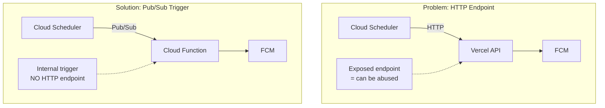
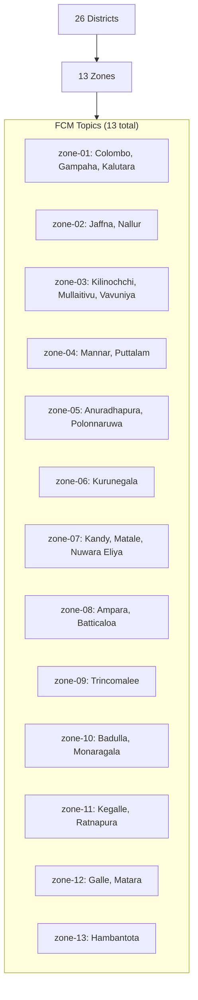
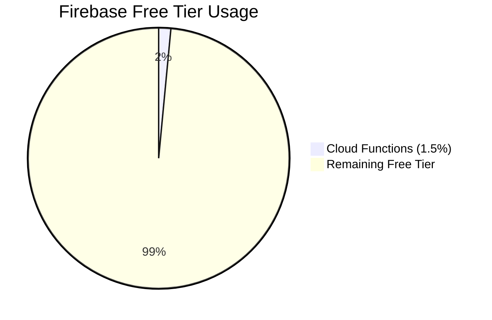
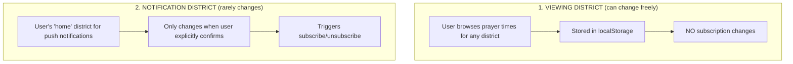
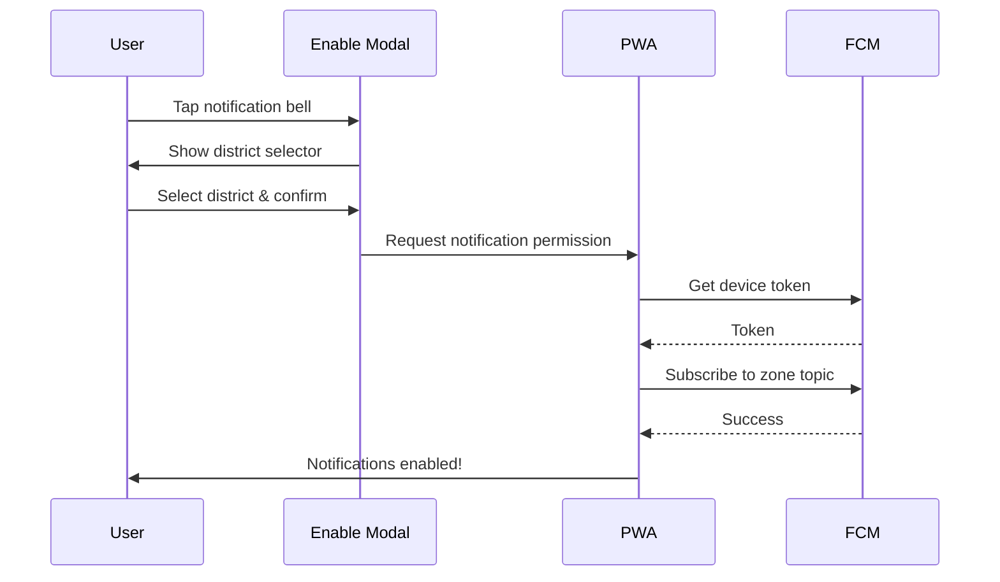
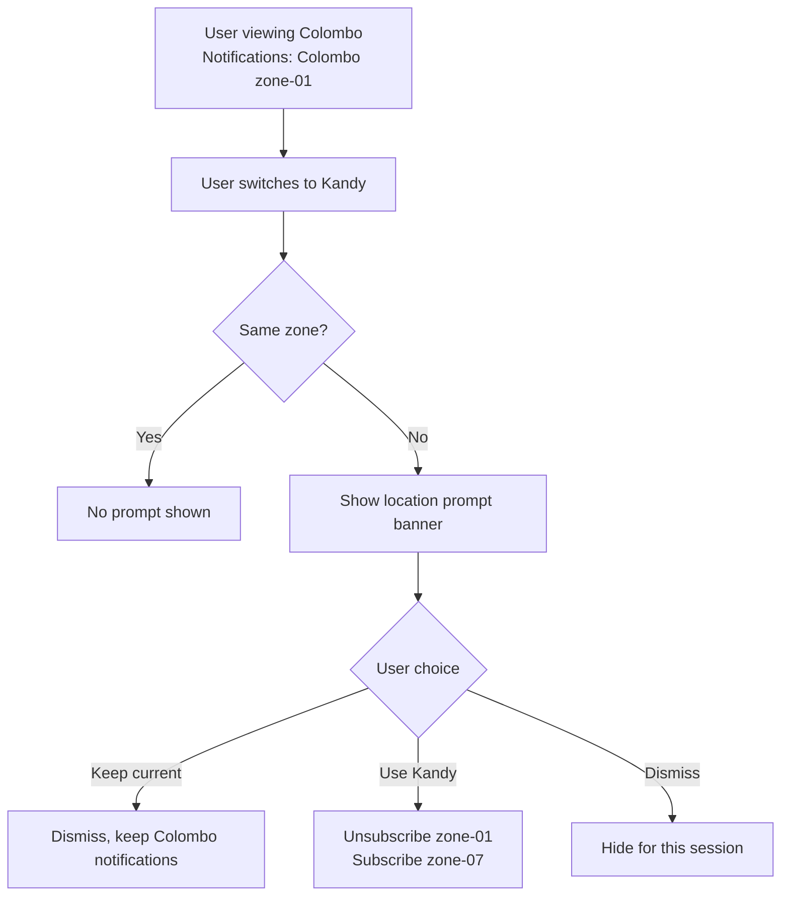
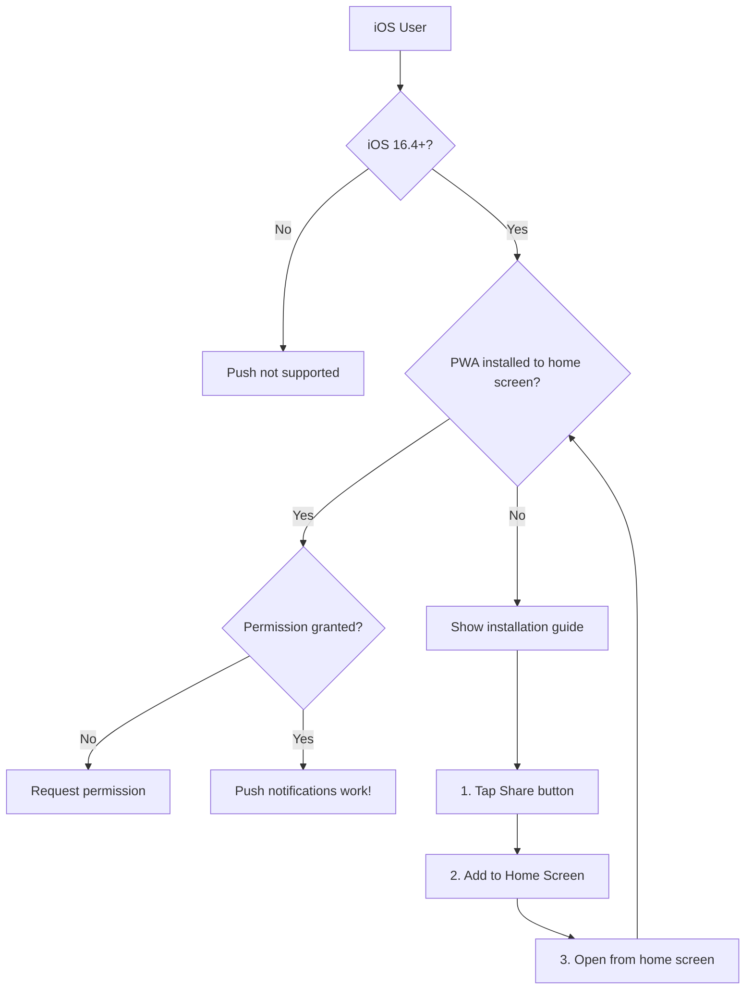

# Push Notifications Implementation Plan

## Goal

Deliver prayer time notifications even when the app is fully closed, on both Android and iOS.

---

## Platform: Firebase Cloud Messaging (FCM)

**Why Firebase?**
- No Google login required for users (just notification permission)
- Topics feature = no database needed for subscriptions
- FCM handles fan-out (1 API call delivers to all subscribers)
- Free tier covers our usage
- Works on Android PWA and iOS PWA (16.4+)

---

## Architecture Overview

```mermaid
flowchart LR
    subgraph Device["User Device (PWA)"]
        User["1. User selects district"]
        Enable["2. User enables notifications"]
        NoLogin["3. No login needed"]
        SW["Service Worker"]
    end
    
    subgraph Firebase["Firebase"]
        FCM["FCM stores subscription"]
        CF["Cloud Function<br/>(Scheduled Cron)"]
    end
    
    User -->|Subscribe to topic<br/>'zone-01'| FCM
    Enable --> FCM
    CF -->|Check: Is it prayer time<br/>for any zone?| CF
    CF -->|Push notification| SW
    SW -->|Shows notification<br/>(even if closed)| User
```

---

## Security Architecture



**Benefits of Pub/Sub approach:**
- No HTTP endpoint exposed to the internet
- Cannot be discovered or abused
- Cannot be DDoS'd to spam notifications
- Direct FCM integration (same Firebase project)

---

## Topics Structure: 13 Zones

Users subscribe to their zone's topic. All prayers are sent to everyone in the zone.



---

## Prayer Time Ranges (Verified from Data)

**Source:** `src/data/prayerTimes.json` (analyzed all 13 zones, 12 months, 365 days)

| Prayer   | Earliest | Latest   | Where Earliest Occurs | Where Latest Occurs |
|----------|----------|----------|----------------------|---------------------|
| Fajr     | 4:21 AM  | 5:13 AM  | Zone 08, May 25      | Zone 02, Jan 29     |
| Sunrise  | 5:45 AM  | 6:33 AM  | Zone 08, May 15      | Zone 02, Jan 20     |
| Dhuhr    | 11:48 AM | 12:27 PM | Zone 08, Oct 27      | Zone 04, Feb 5      |
| Asr      | 3:06 PM  | 3:48 PM  | Zone 08, Sep 3       | Zone 01, Feb 3      |
| Maghrib  | 5:43 PM  | 6:37 PM  | Zone 08, Nov 3       | Zone 02, Jul 4      |
| Isha     | 6:54 PM  | 7:53 PM  | Zone 08, Oct 30      | Zone 02, Jun 28     |

---

## Cron Strategy

**Single Cloud Scheduler job** running every minute from 4 AM to 8 PM:

```
Schedule: "* 4-20 * * *" (every minute, 4:00 AM - 8:59 PM)
Timezone: Asia/Colombo
Runs: 1,020 times/day
```

The function checks if current time matches any prayer for any zone. If not within a prayer window, it exits immediately (minimal cost).

**Why this approach:**
- Uses only 1 Cloud Scheduler job (free tier allows 3)
- Simple cron expression
- Function handles the prayer window logic internally

---

## Cost Analysis



| Resource | Usage | Free Tier Limit | Percentage |
|----------|-------|-----------------|------------|
| Cloud Functions Invocations | ~31,000/month | 2,000,000/month | 1.5% |
| FCM Messages | Unlimited | Unlimited | N/A |
| Cloud Scheduler Jobs | 1 | 3 | 33% |

**TOTAL COST: $0/month**

---

## Implementation Status

### Phase 1: Firebase Setup
- [x] Firebase project created (acju-prayer-time-sl)
- [x] Cloud Messaging (FCM) enabled
- [x] VAPID keys generated
- [x] Firebase config added to app

### Phase 2: Backend - Cloud Functions
- [x] Created `functions/` folder with scheduled function
- [x] Pub/Sub triggered function (no HTTP endpoint)
- [x] Prayer times data copied via predeploy script
- [x] Subscribe/unsubscribe API routes (Vercel)

### Phase 3: Frontend Integration
- [x] Firebase SDK added to PWA
- [x] Service worker configured for push (`firebase-messaging-sw.js`)
- [x] Notification enable modal with district selector
- [x] Location change prompt banner
- [x] Subscribe/unsubscribe logic
- [x] iOS installation detection & guide

### Phase 4: Deployment (Pending)
- [ ] Deploy Cloud Functions (`firebase deploy --only functions`)
- [ ] Test notifications end-to-end
- [ ] Test on Android Chrome (installed PWA)
- [ ] Test on iOS Safari (installed PWA)

---

## Project Structure

```
prayer-times-app/
├── src/
│   ├── data/
│   │   └── prayerTimes.json          # Source of truth for prayer times
│   ├── lib/
│   │   └── firebase/
│   │       ├── config.ts             # Firebase app initialization
│   │       ├── messaging.ts          # Push notification utilities
│   │       └── index.ts              # Module exports
│   ├── hooks/
│   │   └── usePushNotifications.ts   # React hook for notifications
│   └── components/
│       └── notifications/
│           ├── NotificationEnableModal.tsx
│           ├── LocationChangePrompt.tsx
│           └── index.ts
├── api/                               # Vercel API routes
│   └── notifications/
│       ├── subscribe.js              # Subscribe to FCM topic
│       └── unsubscribe.js            # Unsubscribe from FCM topic
├── functions/                         # Firebase Cloud Functions
│   ├── index.js                      # Scheduled notification function
│   ├── package.json
│   └── data/                         # Copied from src/data/ on deploy
│       └── prayerTimes.json
├── public/
│   └── firebase-messaging-sw.js      # Service worker for background push
├── firebase.json                      # Firebase configuration
└── .firebaserc                        # Firebase project reference
```

---

## User Experience Flow

### Key Concepts



### Flow 1: First-Time Notification Enable



### Flow 2: Browsing Different District (Subtle Prompt)

When user changes to a district in a **different zone** while notifications are enabled:



**When to show this prompt:**
- Notifications are enabled AND
- User navigates to a district in a DIFFERENT zone than their notification zone

**When NOT to show:**
- Notifications disabled
- Same zone (e.g., Colombo -> Gampaha, both zone-01)
- User already dismissed for this session

---

## iOS-Specific Requirements



**iOS Push Notification Requirements:**
1. iOS 16.4+ required (Safari 16.4+)
2. PWA MUST be installed to home screen
   - Push does NOT work in Safari browser tab
   - Only works when opened from home screen icon
3. User must grant notification permission

---

## Deployment Instructions

### 1. Set Environment Variables

**Vercel (for subscribe/unsubscribe APIs):**
```
FIREBASE_SERVICE_ACCOUNT_KEY={"type":"service_account",...}
```

**Firebase (set via CLI or Console):**
No additional env vars needed - uses default credentials.

### 2. Deploy Cloud Functions

```bash
# Install Firebase CLI if needed
npm install -g firebase-tools

# Login to Firebase
firebase login

# Navigate to project root
cd prayer-times-app

# Install function dependencies
cd functions && npm install && cd ..

# Deploy functions
firebase deploy --only functions
```

The predeploy script automatically copies `prayerTimes.json` to `functions/data/`.

### 3. Verify Deployment

```bash
# View function logs
firebase functions:log

# Check Cloud Scheduler in Firebase Console
# Console > Functions > sendPrayerNotifications
```

---

## API Reference

### Vercel API Routes

| Endpoint | Method | Purpose |
|----------|--------|---------|
| `/api/notifications/subscribe` | POST | Subscribe device to zone topic |
| `/api/notifications/unsubscribe` | POST | Unsubscribe device from zone topic |

**Subscribe Request:**
```json
{
  "token": "fcm-device-token",
  "topic": "zone-01"
}
```

### Firebase Cloud Function

| Function | Trigger | Schedule |
|----------|---------|----------|
| `sendPrayerNotifications` | Pub/Sub | `* 4-20 * * *` (Asia/Colombo) |

This function is NOT callable via HTTP - it's triggered internally by Cloud Scheduler.

---

## localStorage Structure

```typescript
{
  "selectedDistrict": "kandy",        // Viewing district (can change freely)
  "pushEnabled": "true",              // Push notifications enabled
  "notificationDistrict": "colombo",  // District for notifications
  "notificationZone": "01",           // FCM topic subscribed to
  "fcmToken": "..."                   // Device FCM token
}
```

---

## Summary

| Aspect | Decision |
|--------|----------|
| Platform | Firebase (FCM + Cloud Functions) |
| Topics | 13 (one per zone, all prayers included) |
| Notification Trigger | Pub/Sub scheduled function (secure, no HTTP) |
| Cron Strategy | Single job `* 4-20 * * *` (1,020 runs/day) |
| Cost | $0 (within free tier) |
| User Login | Not required |
| iOS Support | Yes (requires PWA install + iOS 16.4+) |
| Android Support | Yes (PWA or browser) |
| Location UX | Subtle prompt when browsing different zone |
